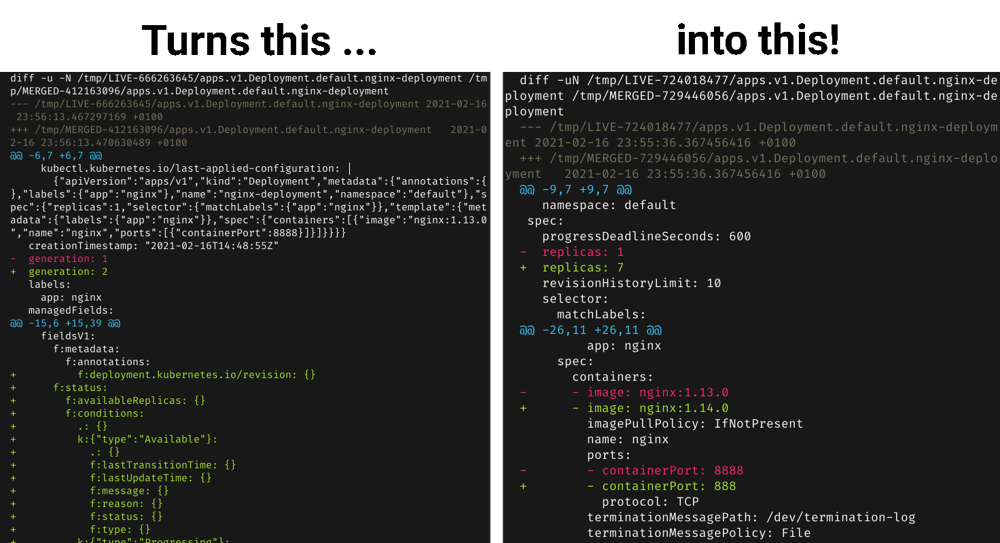

# kubectl-neat-diff

De-clutter your `kubectl diff` output using [kubectl-neat](https://github.com/itaysk/kubectl-neat) (looking at you, `managedFields`):



## Installation

You can try `go get`:

```bash
$ GO111MODULE=on go get github.com/sh0rez/kubectl-neat-diff
```

If that doesn't work, clone and build manually:

```bash
$ git clone https://github.com/sh0rez/kubectl-neat-diff
$ cd kubectl-neat-diff
$ make install
```

[Arch Linux](https://archlinux.org) users can also use the [AUR package](https://aur.archlinux.org/packages/kubectl-neat-diff).

### Usage

To use, set it as your `KUBECTL_EXTERNAL_DIFF` tool:

```bash
# append to ~/.bashrc or similar:
export KUBECTL_EXTERNAL_DIFF=kubectl-neat-diff
```

## Why?

Newer Kubernetes versions (1.18+) add a jungle of keys to any YAML / JSON output that roughly looks like this:

```yaml
managedFields:
  - apiVersion: apps/v1
    fieldsType: FieldsV1
    fieldsV1:
      f:metadata:
        f:annotations:
          .: {}
          f:kubectl.kubernetes.io/last-applied-configuration: {}
        f:labels:
          .: {}
          f:app: {}
      f:spec:
        f:progressDeadlineSeconds: {}
        f:replicas: {}
        f:revisionHistoryLimit: {}
        f:selector: {}
        f:strategy:
          f:rollingUpdate:
            .: {}
            f:maxSurge: {}
            f:maxUnavailable: {}
          f:type: {}
        f:template:
          f:metadata:
            f:labels:
              .: {}
              f:app: {}
          f:spec:
            f:containers:
              k:{"name":"nginx"}:
                .: {}
                f:image: {}
                f:imagePullPolicy: {}
                f:name: {}
                f:ports:
                  .: {}
                  k:{"containerPort":8888,"protocol":"TCP"}:
                    .: {}
                    f:containerPort: {}
                    f:protocol: {}
                f:resources: {}
                f:terminationMessagePath: {}
                f:terminationMessagePolicy: {}
            f:dnsPolicy: {}
            f:restartPolicy: {}
            f:schedulerName: {}
            f:securityContext: {}
            f:terminationGracePeriodSeconds: {}
```

This all has [reasons](https://kubernetes.io/docs/reference/using-api/server-side-apply/#field-management) and is probably a nice thing, but frankly spoken, most of us don't care and don't want to see it all the time:

- Upstream issue: https://github.com/kubernetes/kubernetes/issues/90066
- PR to remove it from `kubectl get`: https://github.com/kubernetes/kubernetes/pull/96878#pullrequestreview-591556511
- People ranting on Twitter:
  - https://twitter.com/eamonb/status/1297998305306316801
  - https://twitter.com/akhilerm/status/1281278930192707584

[kubectl-neat](https://github.com/itaysk/kubectl-neat) is nice tool that cleans up the `kubectl get` output, but unfortunately does not support doing the same for diff. This small project enables it to do so.

## Credits

All the hard work is done by [kubectl-neat](https://github.com/itaysk/kubectl-neat). Go, give them a star!

## License

Licensed under the Apache-v2 license
